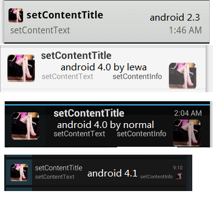
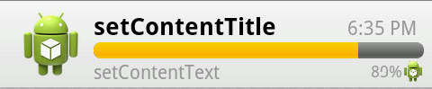
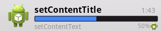
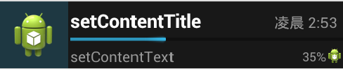
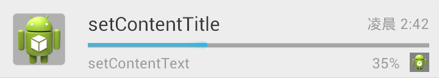

#Android Notifications 4.1 everyWhere#
It is base android 4.1 Notifications Impl

If you want to use all new Notifications features for the old platform, it is good for you.

###Default NotificationCompat###

You see normal NotificationCompat no work all new Notifications features for the platform before api level 16.

If you want old platform use same api and show the some views just use `com.android.support.v8.app.NotificationCompat.Builder` replace `com.android.support.v4.app.NotificationCompat.Builder` ,it works right api level >=8

Here is screenshots;
###android 2.2###

###android 2.3###

###android 4.0###

###android 4.1###

